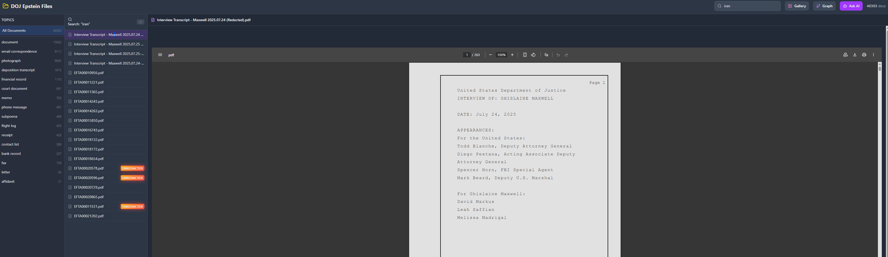

# The Files Made Easy

Search and explore the DOJ Epstein Files with full-text search, AI-powered topic classification, and an AI assistant.

---

## 🚀 Quick Start

### Windows

**Double-click `RUN.bat`** — that's it.

The app will automatically:
1. Install Python (if needed)
2. Set up all dependencies
3. Download and process the files (~18GB, first run only)
4. Install Ollama and AI model (~4GB)
5. Open the web interface in your browser

---

## What It Does

- **Downloads** all files from justice.gov (~18GB)
- **Classifies** documents by topic using AI
- **AI Assistant** - Ask questions, get answers with source citations

---

## Requirements

- Windows 10/11
- 8GB+ RAM recommended
- Internet connection (first run)

---

## AI Assistant

The AI assistant is set up automatically on first run.

**What it does:**
- Answers questions about the documents using local AI (Mistral via Ollama)
- Cites source documents for every answer
- Runs completely offline after setup

**Access:** `http://localhost:5000/chat`

---

## 🌐 Go Live (Share with Others)

Let others browse the files using your computer as the server. They don't need to download anything.

```
python src/main.py live
```
---

## Examples



## Data Source

Files are downloaded from the official DOJ release:  
https://www.justice.gov/epstein/doj-disclosures

---

## ⚠️ Disclaimer

**This software is provided for educational and research purposes only.**

- All documents accessed by this tool are **publicly released by the U.S. Department of Justice** and are in the public domain
- This tool merely provides a convenient interface to browse and search these already-public records
- The developer(s) of this tool make **no claims** about the accuracy, completeness, or interpretation of any documents
- This tool performs **no modifications** to the original documents — it only extracts and indexes text for searchability
- AI-generated summaries and classifications are **automated interpretations** and may contain errors
- Users are responsible for verifying information against original source documents
- This tool is **not affiliated with** the U.S. Department of Justice or any government agency
- Nothing in this tool constitutes legal advice or factual assertions

**By using this software, you acknowledge:**
- You will use it only for lawful purposes
- You will not use it to harass, defame, or harm any individuals
- You understand that the content may be disturbing or sensitive in nature
- You are solely responsible for how you use or share any information obtained